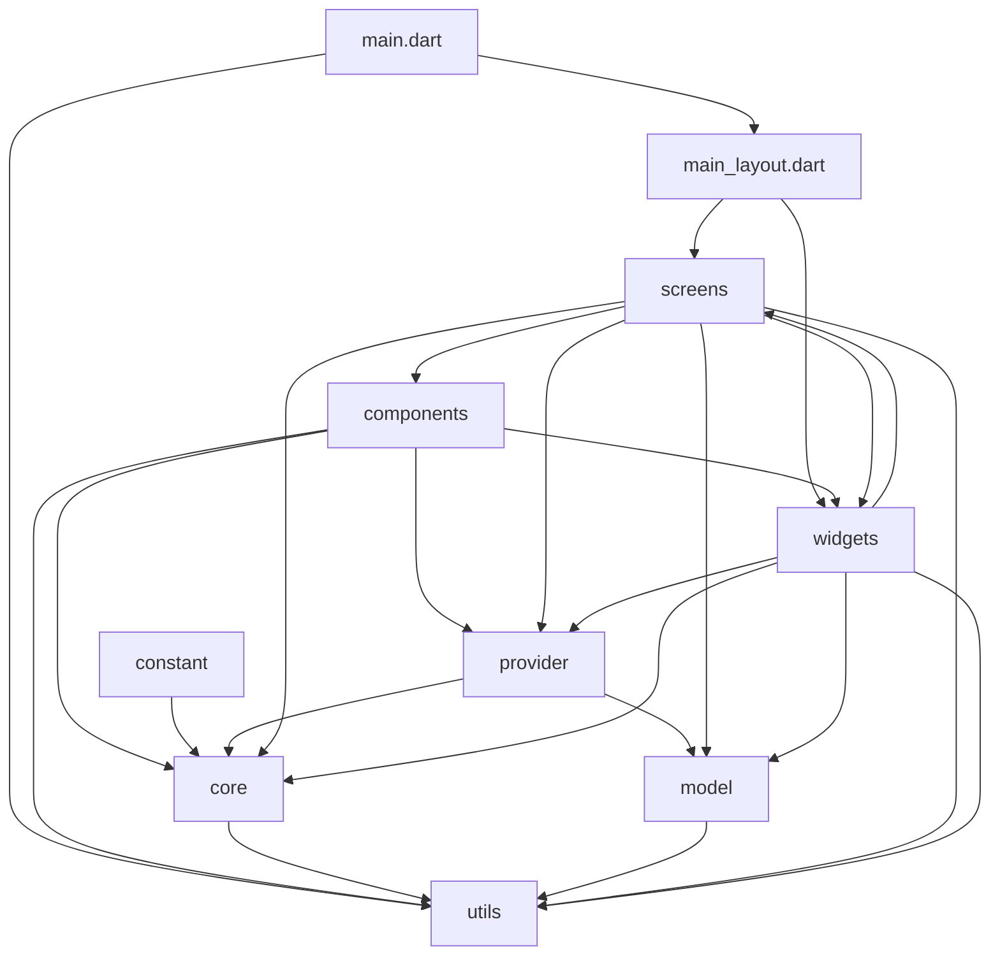
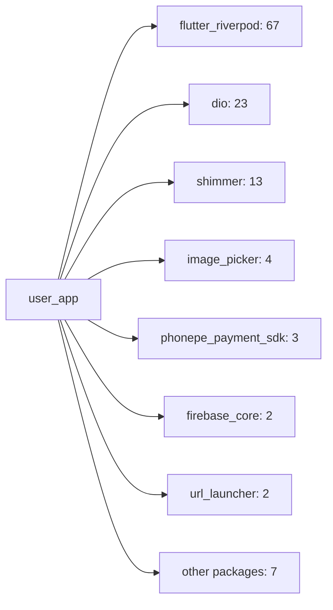
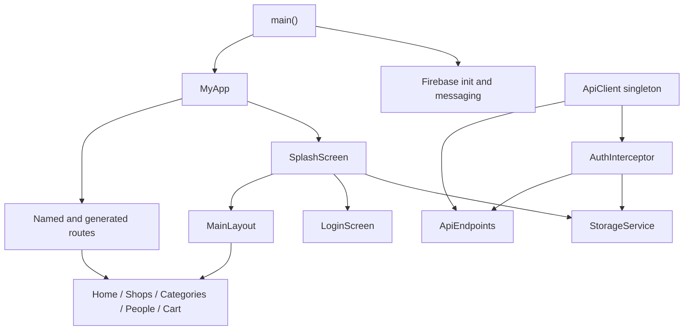

# Project Graph

Generated from Dart imports under `lib/`.

## Module Dependency Graph

## Heaviest Internal Edges

| Imports | Edge |
| ---: | --- |
| 59 | `provider -> core` |
| 47 | `screens -> provider` |
| 30 | `widgets -> provider` |
| 28 | `widgets -> utils` |
| 26 | `screens -> utils` |
| 26 | `screens -> core` |
| 21 | `widgets -> model` |
| 16 | `widgets -> core` |
| 8 | `screens -> widgets` |
| 5 | `core -> utils` |

## File Counts By Area

| Files | Area |
| ---: | --- |
| 71 | `widgets` |
| 34 | `screens` |
| 22 | `provider` |
| 8 | `core` |
| 7 | `utils` |
| 4 | `model` |
| 1 | `components` |
| 1 | `constant` |
| 1 | `firebase_options.dart` |
| 1 | `main.dart` |
| 1 | `main_layout.dart` |
| 1 | `unknown_page.dart` |

## External Package Hotspots

## Runtime Shape

## Reading Notes

- `core/api` is the API foundation: `ApiClient` builds Dio clients, `AuthInterceptor` attaches and refreshes tokens, and `ApiEndpoints` centralizes paths.
- `provider` depends heavily on `core`, which suggests providers are the main data-access layer.
- `screens` and `widgets` are the widest consumers of providers and shared utilities.
- `widgets` imports `screens` once, which is worth watching because it can make UI composition harder to untangle over time.
